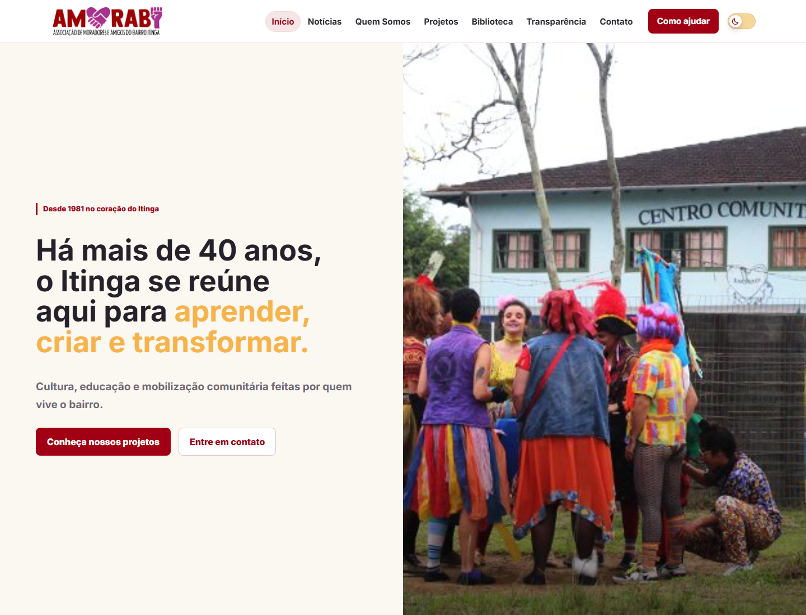
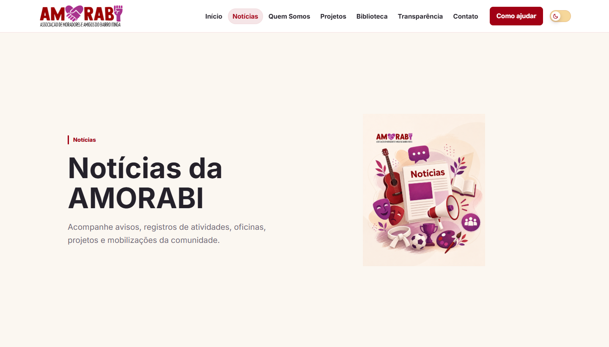
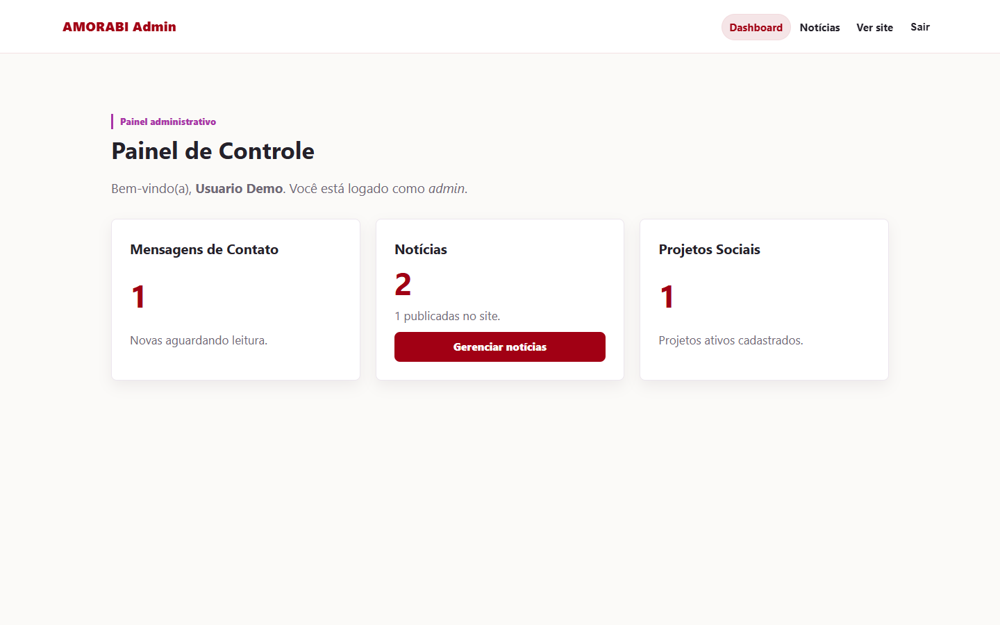

# AMORABI

Site institucional e painel administrativo desenvolvidos para a **AMORABI - Associação dos Moradores e Amigos do Bairro Itinga**, uma organização comunitária de Joinville/SC.

**Site em produção:** [https://amorabi.com.br/](https://amorabi.com.br/)

## Sobre a AMORABI

A AMORABI é uma associação comunitária do bairro Itinga, em Joinville/SC, fundada em 1981. A organização atua em iniciativas de cultura, educação popular, biblioteca comunitária, esporte, lazer, assistência social e mobilização comunitária.

## Sobre o projeto

O projeto foi desenvolvido para reunir, em um único site, informações institucionais, projetos, notícias, documentos públicos, canais de contato e formas de apoio à AMORABI.

Além do site público, foi criado um **painel administrativo** para que a própria organização possa cadastrar, editar e publicar notícias sem precisar mexer no código. Isso torna a atualização do conteúdo mais simples e mantém o site útil no dia a dia.

O sistema está atualmente em produção e é utilizado na publicação e atualização dos conteúdos da organização.

## O que foi desenvolvido

### Site público

- Página inicial com apresentação da AMORABI, fotos reais das atividades, chamadas para projetos, notícias recentes e contato.
- Página institucional com história da associação, realizações, reconhecimentos e linha do tempo.
- Página de projetos com atividades culturais, esportivas, educacionais, teatro comunitário, cursinho popular e Projeto Mulheres em Ação.
- Página da Biblioteca Comunitária Lutador Dito, com informações sobre leitura, atividades, memória local e acervo comunitário.
- Área de notícias com listagem pública e página individual para cada publicação.
- Página de transparência com documentos públicos em PDF.
- Página de contato com WhatsApp, redes sociais, localização no mapa e informações para apoio/doação.
- Geração de QR Code Pix para doações, a partir do valor informado pelo visitante.
- Interface responsiva, adaptada para desktop e celular.
- Tema claro e escuro.

### Painel administrativo

- Login para acesso administrativo.
- Dashboard com visão geral de conteúdos cadastrados.
- Cadastro, edição, publicação e exclusão de notícias.
- Upload de imagens para notícias.
- Controle de notícias em rascunho ou publicadas.
- Diferenciação de permissões entre usuários administrativos e editores.

## Screenshots

Capturas das principais telas do projeto. As páginas públicas foram registradas a partir da versão em produção; a tela administrativa foi capturada em ambiente local, sem dados sensíveis.

<p align="center">
  <strong>Página inicial</strong><br>
  
</p>

<p align="center">
  <strong>Projetos e notícias</strong><br>
  
  
</p>

<p align="center">
  <strong>Versão mobile e painel administrativo</strong><br>
  
  
</p>

## Tecnologias utilizadas

### Front-end

- HTML5
- CSS3
- JavaScript puro

### Back-end

- PHP
- PDO para conexão com banco de dados
- Sistema próprio de rotas amigáveis
- Sessões PHP para autenticação administrativa

### Banco de dados

- MySQL/MariaDB
- Schema disponível em [`database/amorabi.sql`](database/amorabi.sql)

### Infraestrutura e ferramentas

- Apache com `.htaccess` e `mod_rewrite`
- Estrutura compatível com XAMPP/local Apache
- Configuração por arquivo `.env`
- `robots.txt` e `sitemap.xml`

## Segurança

O projeto foi desenvolvido com cuidados importantes para um site com área administrativa e upload de imagens. Entre eles estão autenticação com sessão, senhas armazenadas por hash, proteção contra CSRF em ações sensíveis, limitação de tentativas de login, validação de uploads e regras de servidor para bloquear acesso direto a diretórios e arquivos internos.

As configurações sensíveis ficam fora do código versionado, usando `.env` local e `.env.example` como modelo seguro.

## SEO e produção

O site conta com recursos para publicação e indexação, incluindo rotas amigáveis, sitemap, robots.txt, meta description global, textos alternativos em imagens e layout responsivo.

A versão publicada pode ser acessada em:

[https://amorabi.com.br/](https://amorabi.com.br/)

## Estrutura do projeto

```txt
admin/                 Painel administrativo
app/config/            Configuração de ambiente e banco de dados
app/controllers/       Endpoints da aplicação
app/helpers/           Funções compartilhadas, sessão, segurança e rotas
app/services/          Serviços de domínio, como geração de payload Pix
database/              Schema SQL do banco
public/                Páginas públicas, assets, uploads e documentos
storage/               Sessões e cache gerados pela aplicação
index.php              Roteador principal
robots.txt             Regras para mecanismos de busca
sitemap.xml            Sitemap público
```

## Executando localmente

Esta seção é destinada a desenvolvedores que desejam rodar o projeto em ambiente local.

### Requisitos

- PHP com suporte a PDO MySQL.
- MySQL ou MariaDB.
- Apache com `mod_rewrite` habilitado.
- Ambiente local como XAMPP.

### Passos

1. Coloque o projeto em um diretório servido pelo Apache, por exemplo:

```txt
C:\xampp\htdocs\amorabi
```

2. Crie o banco e importe o schema:

```sql
SOURCE database/amorabi.sql;
```

Ou importe o arquivo `database/amorabi.sql` pelo phpMyAdmin/MySQL.

3. Crie o arquivo `.env` a partir do modelo:

```bash
cp .env.example .env
```

No Windows, se estiver usando PowerShell:

```powershell
Copy-Item .env.example .env
```

4. Ajuste as variáveis locais no `.env`, usando valores próprios do ambiente:

```env
APP_ENV=local
APP_URL=http://localhost/amorabi

DB_HOST=localhost
DB_PORT=3306
DB_NAME=amorabi_site
DB_USER=root
DB_PASS=

PIX_KEY=
PIX_RECEIVER_NAME=AMORABI
PIX_RECEIVER_CITY=JOINVILLE
PIX_TXID_PREFIX=AMORABI
PIX_MIN_AMOUNT=5
PIX_MAX_AMOUNT=5000
```

5. Acesse no navegador:

```txt
http://localhost/amorabi
```

O painel administrativo fica em:

```txt
http://localhost/amorabi/admin
```

O script SQL cria a estrutura do banco, mas não inclui credenciais administrativas. Para usar o painel localmente, é necessário criar um registro em `admin_users` com uma senha gerada por `password_hash`.

## Desenvolvedor

**Caetano Gbur Petry**

GitHub: [github.com/caetanopetry](https://github.com/caetanopetry)
